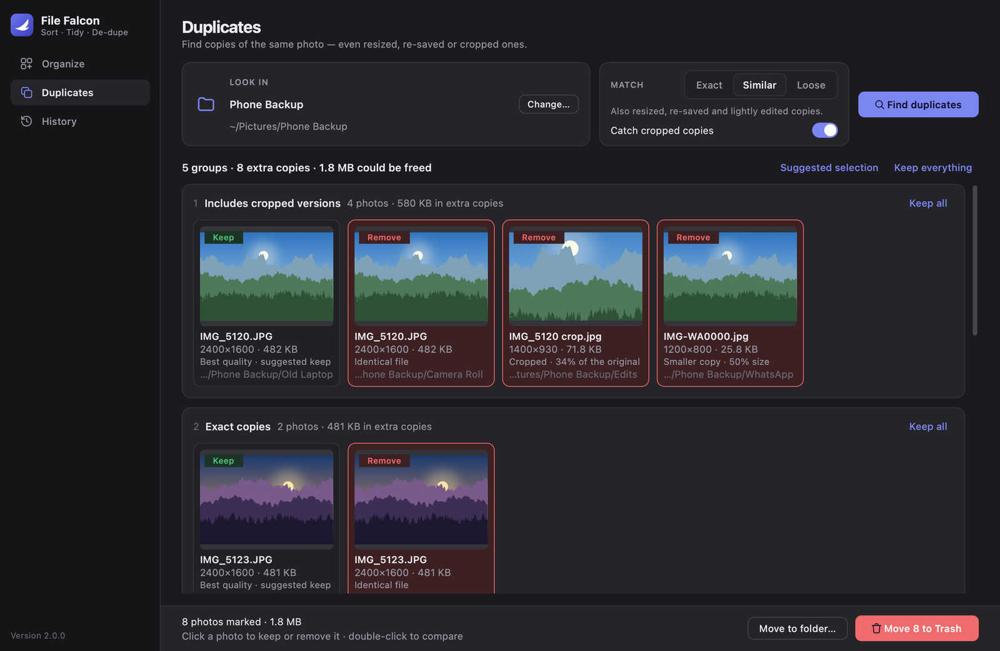
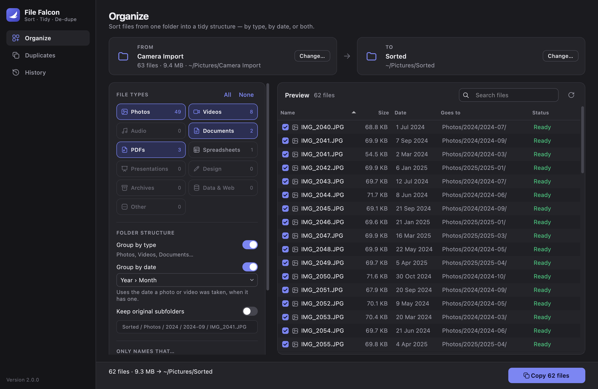

<p align="center">
  
</p>

<h1 align="center">File Falcon Pro</h1>

<p align="center">
  Sort messy folders into a tidy structure, and clear out duplicate photos —<br>
  even the resized, re-saved and cropped ones.
</p>

<p align="center">
  <a href="https://github.com/drobertson-dev/FileFalconPro/actions/workflows/ci.yml"></a>
  
  
  <a href="LICENSE"></a>
</p>

<p align="center">
  
</p>

## Why

Camera imports, phone backups and years of downloads pile up into folders nobody wants to
open. File Falcon Pro sorts them out in a few clicks, shows you exactly what will happen
before it touches anything, and keeps a record of every change so you can put things back.

## Features

**Organize** — sort a folder by type, by date, or both

- Tick the kinds of files you care about: photos, videos, audio, documents, PDFs,
  spreadsheets, presentations, design files, archives and more.
- Build the folder structure you want: `Photos/2024/2024-03/`, keep the original
  subfolders, or flatten everything — any combination.
- Dates come from when a photo or video was **taken** (EXIF and QuickTime metadata), so
  files copied off a phone still land in the right month.
- A live preview shows where each file will go; untick anything you want left alone.
- Copy or move. Nothing is ever overwritten: identical files are skipped and name clashes
  become `IMG_1234 (1).jpg`.

**Duplicates** — find copies of the same photo

- **Exact** copies, byte for byte.
- **Similar** copies: resized, re-saved, recompressed or lightly edited.
- **Cropped** copies, found by matching features between photos.
- Review each group side by side; the best-quality photo is suggested to keep. Send the
  rest to the Trash or into a folder.

**History** — undo anything

- Every run is journaled as it happens. Undo moves files back, or sends copies to the
  Trash — even for runs that were cancelled or interrupted.

<p align="center">
  
</p>

<details>
<summary><b>More screenshots</b> — History and dark mode</summary>
<br>
<p align="center">
  
  
  
</p>
</details>

## Install

### Download

Get the latest **`.dmg`** from
[Releases](https://github.com/drobertson-dev/FileFalconPro/releases/latest) — for Apple
silicon Macs running macOS 14 Sonoma or later. Open it and drag **File Falcon Pro** onto
**Applications**.

The app isn't signed with an Apple Developer ID, so the first time you open it macOS will
refuse. Go to **System Settings → Privacy & Security**, scroll down and click
**Open Anyway** — you only need to do this once.

### Build it yourself

You need [uv](https://docs.astral.sh/uv/) (`brew install uv`).

```bash
git clone https://github.com/drobertson-dev/FileFalconPro.git
cd FileFalconPro
make install
```

That builds a standalone **File Falcon Pro.app** for your Mac and puts it in
`/Applications` — launch it from Launchpad, Spotlight or the Dock like any other app. Python
is bundled inside, so the app keeps working even if you delete the project folder. (No
`make`? Run `./scripts/build_macos.sh --install` instead.)

Prefer to run straight from the source?

```bash
make run        # or: uv run python main.py
```

The code is plain Python and Qt, so it should also run from source on Windows and Linux,
though only macOS is regularly tested.

## Documentation

- [User guide](docs/user-guide.md) — every option explained, plus FAQ
- [How it works](docs/how-it-works.md) — the planner, the undo journal and the duplicate detector
- [Development](docs/development.md) — running tests, building the app, making a release

## Privacy

Everything happens on your Mac. File Falcon Pro has no network code, no accounts and no
telemetry; the only things it writes besides your files are its settings, history and a
cache of image fingerprints in your Library folder.

## Contributing

Bug reports and pull requests are welcome — see [CONTRIBUTING.md](CONTRIBUTING.md).

## License

[MIT](LICENSE)
