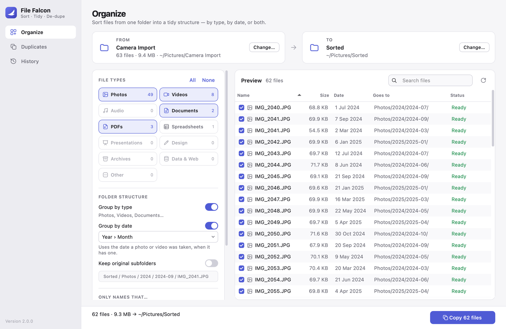
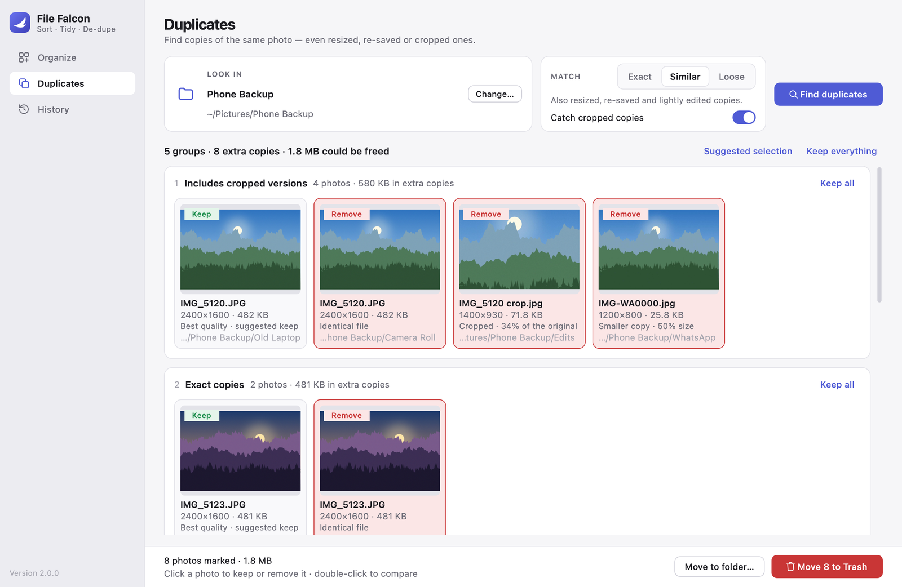
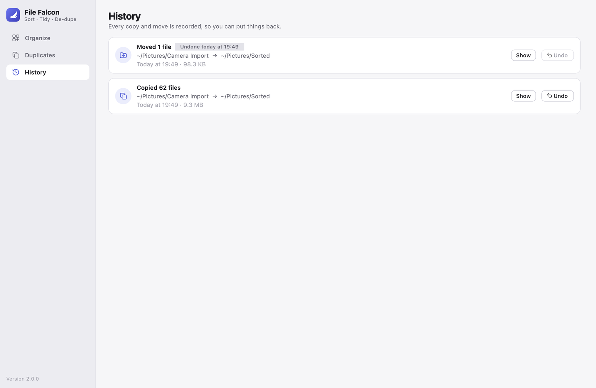

# User guide

File Falcon Pro has three pages, listed in the sidebar: **Organize**, **Duplicates** and
**History**. You can also switch between them with <kbd>⌘1</kbd>, <kbd>⌘2</kbd> and
<kbd>⌘3</kbd>.

Nothing on disk changes until you press the big button at the bottom of a page, and every
change can be undone from History.

- [Organize](#organize)
- [Duplicates](#duplicates)
- [History](#history)
- [Safety](#safety)
- [FAQ](#faq)

---

## Organize

### 1. Choose the folders

- **From** is the folder to sort. Everything inside it, including subfolders, is scanned.
- **To** is where sorted files go.

Click a card to browse, or drag a folder from Finder onto it. The From card shows how many
files were found and their total size.

> **Sorting in place:** set To to the same folder as From to tidy a folder into itself.
> Files that are already in the right place are left alone.
>
> **Destination inside the source:** if To is a folder inside From (for example
> `Downloads/Sorted`), it is left out of the scan so files are never sorted twice.

### 2. Pick file types

Tick the chips for the kinds of files to include. The number on each chip is how many of
those files are in the folder. **All** ticks every type except *Other*; **None** clears
the selection.

| Type | Examples |
| --- | --- |
| Photos | `.jpg` `.heic` `.png` `.webp` `.gif` `.tiff`, and RAW (`.cr2` `.cr3` `.nef` `.arw` `.dng` …) |
| Videos | `.mov` `.mp4` `.m4v` `.mkv` `.avi` `.mts` `.3gp` … |
| Audio | `.mp3` `.m4a` `.wav` `.flac` `.aiff` `.ogg` … |
| Documents | `.docx` `.pages` `.txt` `.md` `.rtf` `.epub` … |
| PDFs | `.pdf` |
| Spreadsheets | `.xlsx` `.numbers` `.csv` … |
| Presentations | `.key` `.pptx` … |
| Design | `.psd` `.ai` `.sketch` `.fig` `.svg` … |
| Archives | `.zip` `.dmg` `.7z` `.rar` … |
| Data & Web | `.json` `.xml` `.yaml` `.html` `.sqlite` … |
| Other | anything not listed above |

Each extension belongs to exactly one type. Ambiguous ones (such as `.ts`, which can be
code or video) are treated as *Other*.

### 3. Choose a folder structure

Turn on any combination of:

| Option | Result |
| --- | --- |
| **Group by type** | `Photos/`, `Videos/`, `PDFs/` … |
| **Group by date** | `2024/` · `2024/2024-03/` · `2024/2024-03/2024-03-15/` · `2024-03/` |
| **Keep original subfolders** | the file's folders inside the source are recreated |

The grey line under the options shows an example path using a real file from your folder.

**Which date is used?** For photos, the date the picture was taken (EXIF). For videos, the
recording date stored in the movie file. For everything else — or media without that
information — the file's own date (the earlier of created and modified). Hover over a date
in the preview to see where it came from.

### 4. Optionally filter by name

Only include files whose name…

| Mode | Example | Matches |
| --- | --- | --- |
| contains | `invoice` | `Invoice 2024-03.pdf`, `old invoice.pdf` |
| is exactly | `report` | `report.pdf`, `Report.docx` (with or without extension) |
| matches wildcard | `IMG_*.jpg` | `IMG_1234.jpg` |
| matches regex | `\d{4}-\d{2}` | `Invoice 2024-03.pdf` |

Matching ignores upper/lower case.

### 5. Copy or move

- **Copy** leaves the originals where they are.
- **Move** takes them out of the source folder. With **Tidy up emptied folders** on,
  subfolders left empty by the move are removed (undo brings them back).

### 6. Check the preview, then run

The preview lists every matching file and where it will go. Click a column header to sort,
use the search box to filter, double-click a file to open it, or right-click for more.

Untick a file (or select several and press <kbd>Space</kbd>) to leave it out.

| Status | Meaning |
| --- | --- |
| **Ready** | Will be copied or moved. |
| **Renamed** | A different file with the same name is already there, so this one gets a numbered name such as `IMG_1234 (1).jpg`. |
| **Check first** | A file with the same name and size is there. They're compared byte for byte when you run: identical files are skipped, otherwise this one is renamed. |
| **Already there** | The same file (name, size and modified time) is already at the destination. Nothing to do. |
| **Already sorted** | The file is already exactly where it would go. |
| **Skipped** | You unticked it. |

Press **Copy *N* files** / **Move *N* files**. Moves ask for confirmation first. A progress
bar shows how far along it is; **Cancel** stops after the current file. When it finishes, a
banner offers **Show in Finder** and **Undo**.

---

## Duplicates

### Find

1. Choose the folder to check under **Look in**. Subfolders are included.
2. Pick how hard to look:
   - **Exact** — only byte-for-byte identical files. Very fast.
   - **Similar** *(recommended)* — also resized, re-saved, recompressed and lightly edited
     copies.
   - **Loose** — casts a wider net, such as heavier edits. Check the results carefully.
3. Leave **Catch cropped copies** on to also find photos that are a crop of another.
4. Press **Find duplicates**.

The first scan of a large library takes a while because every photo is opened once; the
results are cached, so later scans of the same folder are much faster.

Supported formats: JPEG, HEIC/HEIF, PNG, WebP, GIF, TIFF, BMP and AVIF. RAW files aren't
compared.

### Review

Each group is a set of photos that look like the same picture. The photo with the most
pixels (then the largest file) is marked **Keep**; the others are marked **Remove**. Under
each photo you'll see how it relates to the kept one:

- *Identical file* — the same bytes.
- *Smaller copy* — the same picture at a lower resolution (often from messaging apps).
- *Similar · edited or re-saved* — the same picture with different compression or edits.
- *Cropped · 36% of the original* — part of the kept photo.

To change what happens:

- **Click** a photo to switch it between Keep and Remove.
- **Double-click** to compare it side by side with the kept photo.
- **Right-click** for *Keep only this one*, *Show in Finder* and *Open*.
- **Keep all** on a group means "these aren't duplicates".
- **Suggested selection** and **Keep everything** reset the marks for all groups.

If every photo in a group is marked, you'll be warned before anything is removed.

### Clean up

- **Move *N* to Trash** — the marked photos go to the macOS Trash. Use Finder's
  *Put Back* to restore one.
- **Move to folder…** — the marked photos move into a folder you choose, for example to
  review later. This is recorded in History and can be undone.

---

## History

Every copy or move — from Organize, or from *Move to folder…* on the Duplicates page — is
listed here, newest first.

- **Undo** a move: files go back to where they were, and folders that were tidied away are
  recreated.
- **Undo** a copy: the copies go to the Trash. Your originals aren't touched.
- **Show** opens the destination folder in Finder.

Undo is careful: a copy you've edited since is kept, and a file is never moved back on top
of something new. Anything that was left alone is listed in **Details**.

Runs that were cancelled or interrupted (for example by a crash) can be undone too, because
the journal is written as each file is processed.

---

## Safety

- **Nothing is overwritten.** Identical files are skipped; different files with the same
  name get a numbered name.
- **No half-copied files.** Copies are written to a hidden temporary file and renamed into
  place once complete.
- **macOS packages are left alone.** Photos libraries, app bundles and similar
  "folder-like documents" are never opened up.
- **Hidden files are skipped**, along with symbolic links.
- **Names are compared case-insensitively**, so `IMG.JPG` and `img.jpg` are treated as a
  clash — as they are on macOS and Windows.

## FAQ

**Where are my settings and history kept?**
In `~/Library/Application Support/File Falcon Pro` (settings, history journals and a log
file). The duplicate finder's cache is in `~/Library/Caches/File Falcon Pro`. Deleting
either folder simply resets the app.

**macOS asks whether File Falcon Pro can access my Downloads/Documents/Desktop.**
That's normal for any app that reads those folders. Click *Allow*; you can change it later
in *System Settings → Privacy & Security → Files and Folders*.

**macOS says the app "can't be opened" or is from an unidentified developer.**
This happens when an app built on one Mac is copied to another, because it isn't signed
with an Apple Developer ID. Open *System Settings → Privacy & Security*, scroll down and
click *Open Anyway* — or build it yourself on that Mac with `make install`.

**A photo landed in the wrong month.**
It probably has no capture date in its metadata (screenshots and images saved from the
web often don't), so the file date was used. Hover over the date in the preview to check.

**Two different photos were grouped as duplicates.**
Similar shots taken a second apart can look like near-duplicates. Click *Keep all* on that
group, or use the **Exact** or **Similar** level instead of **Loose**.

**Does it send anything over the internet?**
No. Everything happens locally.
